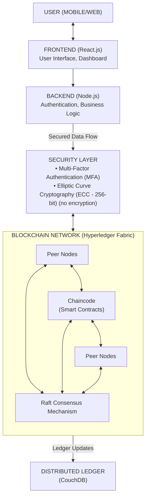

# 🔗 Blockchain UPI System

[](https://youtu.be/W8t4YhAVe8M?si=syz_3MSfSbamFKnY)

A secure, blockchain-based UPI payment system with fraud detection, real-time monitoring, and admin analytics.

## 🚀 Features

- **🔐 Secure Authentication**: Device-based security with UPI ID verification
- **💸 Money Transfers**: Real-time blockchain-based transactions
- **🛡️ Fraud Detection**: AI-powered fraud detection system
- **📊 Admin Analytics**: Comprehensive transaction monitoring
- **⚡ Real-time Updates**: WebSocket-based live updates
- **📱 Responsive UI**: Modern, mobile-friendly interface

## 🏗️ Architecture



- **Frontend**: React.js with Tailwind CSS
- **Backend**: Node.js with Express.js
- **Blockchain**: Hyperledger Fabric
- **Database**: In-memory storage (can be extended to MongoDB/PostgreSQL)
- **Real-time**: Socket.IO for live updates

## 📋 Prerequisites

- Node.js (v16 or higher)
- npm or yarn
- Git

## 🛠️ Local Development Setup

### 1. Clone the Repository
```bash
git clone <repository-url>
cd "Block Chain UPI"
```

### 2. Install Dependencies

#### Backend Setup
```bash
cd backend
npm install
```

#### Frontend Setup
```bash
cd frontend
npm install
```

### 3. Environment Configuration

#### Backend Environment (.env)
Create `backend/.env`:
```env
PORT=5001
JWT_SECRET=your-super-secret-jwt-key-here
NODE_ENV=development
```

#### Frontend Environment
Create `frontend/.env`:
```env
REACT_APP_API_URL=http://localhost:5001
REACT_APP_SOCKET_URL=http://localhost:5001
```

### 4. Start Development Servers

#### Start Backend
```bash
cd backend
npm start
```

#### Start Frontend (in new terminal)
```bash
cd frontend
npm start
```

### 5. Access the Application
- **Frontend**: http://localhost:3000
- **Backend API**: http://localhost:5001

## 🌐 Hostinger Deployment

### 1. Prepare for Deployment

#### Build Frontend
```bash
cd frontend
npm run build
```

#### Prepare Backend
```bash
cd backend
npm install --production
```

### 2. Upload to Hostinger

#### Frontend Deployment
1. **Upload** the `frontend/build` folder to your Hostinger hosting
2. **Set domain** to point to the uploaded files
3. **Configure** .htaccess for React Router (if needed)

#### Backend Deployment
1. **Upload** the `backend` folder to your Hostinger VPS/Node.js hosting
2. **Set environment variables** in Hostinger panel
3. **Configure** domain/subdomain for API

### 3. Environment Variables for Production

#### Backend (.env)
```env
PORT=5001
JWT_SECRET=your-production-jwt-secret
NODE_ENV=production
CORS_ORIGIN=https://yourdomain.com
```

#### Frontend (.env.production)
```env
REACT_APP_API_URL=https://api.yourdomain.com
REACT_APP_SOCKET_URL=https://api.yourdomain.com
```

### 4. Start Production Server
```bash
cd backend
npm start
```

## 👥 Demo Accounts

### Admin Account
- **UPI ID**: `testadmin@npci`
- **Password**: `test123`
- **Device ID**: `test001`
- **Balance**: ₹700
- **Access**: Admin Panel

### Regular User
- **UPI ID**: `testuser1@bank1`
- **Password**: `test123`
- **Device ID**: `test002`
- **Balance**: ₹5,100
- **Access**: User Dashboard

### Transfer Test Account
- **UPI ID**: `testuser2@bank2`
- **Password**: `test123`
- **Device ID**: `test003`
- **Balance**: ₹4,200
- **Purpose**: Money Transfers

## 🧪 Testing

### Test Money Transfers
1. Login with `testuser1@bank1`
2. Send ₹100 to `testuser2@bank2`
3. Check both accounts for updated balances

### Test Fraud Detection
1. Login with `testuser1@bank1`
2. Try sending ₹4,500+ to any account
3. Observe fraud detection blocking the transaction

### Test Admin Features
1. Login with `testadmin@npci`
2. Access admin panel
3. View system analytics and transaction history

## 📁 Project Structure

```
Block Chain UPI/
├── backend/                 # Node.js backend
│   ├── routes/             # API routes
│   ├── services/           # Business logic
│   ├── middleware/         # Custom middleware
│   └── server.js           # Main server file
├── frontend/               # React frontend
│   ├── src/
│   │   ├── components/     # React components
│   │   ├── pages/          # Page components
│   │   ├── contexts/       # React contexts
│   │   └── App.js          # Main app component
│   └── public/             # Static files
├── blockchain-network/      # Blockchain configuration
├── smart-contracts/        # Smart contract files
└── docs/                   # Documentation
```

## 🔧 Configuration

### API Endpoints

#### Authentication
- `POST /api/auth/register` - User registration
- `POST /api/auth/login` - User login
- `GET /api/auth/profile` - Get user profile

#### Transactions
- `POST /api/transactions/transfer` - Money transfer
- `GET /api/transactions/history` - Transaction history
- `GET /api/transactions/stats` - Transaction statistics

#### Admin
- `GET /api/admin/analytics` - System analytics
- `GET /api/admin/transactions` - All transactions
- `GET /api/admin/fraud-alerts` - Fraud alerts

### Environment Variables

| Variable | Description | Default |
|----------|-------------|---------|
| `PORT` | Server port | 5001 |
| `JWT_SECRET` | JWT signing secret | Required |
| `NODE_ENV` | Environment mode | development |
| `CORS_ORIGIN` | CORS allowed origins | * |

## 🚨 Troubleshooting

### Common Issues

#### Frontend Not Loading
- Check if backend is running on correct port
- Verify API URL in environment variables
- Clear browser cache and reload

#### Authentication Errors
- Verify JWT_SECRET is set correctly
- Check if user exists in system
- Ensure device ID matches

#### Transfer Failures
- Verify sufficient balance
- Check fraud detection rules
- Ensure both accounts are active

### Debug Commands

#### Check Backend Status
```bash
curl http://localhost:5001/health
```

#### Test API Endpoints
```bash
# Test login
curl -X POST http://localhost:5001/api/auth/login \
  -H "Content-Type: application/json" \
  -d '{"upiID": "testuser1@bank1", "password": "test123", "deviceID": "test002"}'
```

## 📞 Support

For issues and questions:
1. Check the troubleshooting section
2. Review the demo accounts for testing
3. Verify environment configuration
4. Test with provided demo credentials

## 📄 License

This project is for educational and demonstration purposes.

---

**🎉 Ready to use! Start with the demo accounts to explore all features.**
